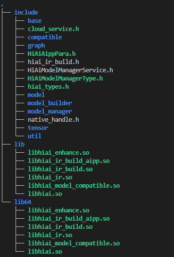

- [HUAWEI HiAI Foundation介绍](#huawei-hiai-foundation介绍)
- [工程结构介绍](#工程结构介绍)
- [编译](#编译)
    - [编译环境配置](#编译环境配置)
    - [编译执行](#编译执行)
    - [编译输出](#编译输出)
  - [APP集成](#app集成)
- [版本说明](#版本说明)
- [许可证](#许可证)


## HUAWEI HiAI Foundation介绍


华为终端有强大的AI能力，为了让开发者能够更简单快捷的应用华为终端的AI能力，HUAWEI HiAI基于“芯、端、云”三层开放架构，构筑全面开放的智慧生态，让开发者能够快速地利用华为强大的AI处理能力，为用户提供更好的智慧应用体验。

HUAWEI HiAI Foundation作为芯片使能的基础平台，提供了300+算子的支持，具备业界最佳的模型兼容性，为众多业务场景提供了更高性能更低功耗的计算环境。

 

HUAWEI HiAI Foundation衔接智慧业务和计算芯片，提供轻量化模型计算能力，支持华为MindSpore、TensorFlow、Caffe、Paddle、ONNX、AndroidNN等框架的对接，支持芯片内多计算单元的异构计算，为开发者提供模型量化，模型转换，性能调优，维测等高效工具链。

HiAI DDK开发套件将其AI推理能力封装在动态库文件里，通过此方式集成在用户app中，因此HiAI DDK支持跨平台交叉编译，目前支持情况如下所示：

| 硬件平台   |                                                              | 状态 |
| :--------- | :----------------------------------------------------------- | :--- |
| Kirin 平台 | Kirin 820、Kirin 985 、Kirin 990 、Kirin 990 5G 、Kirin 990E 、Kirin 9000 、Kirin 9000E | ✔️    |

| 操作系统 | 状态 |
| :------- | :--- |
| 鸿蒙3.0  | ✔️    |


## 工程结构介绍
| 文件/目录名 | 说明                                                   |
| -------------- | ------------------------------------------------------------ |
| api | 开放接口目录 |
| build   | 编译架构源码目录 |
| cmake | 编译过程中用到的cmake文件 |
| config | 配置文件目录 |
| doc | 文档目录 |
| inc | 头文件接口目录 |
| script | 工程使用到的脚本目录 |
| src | 源码目录 |
| tests | 测试源码目录 |
| CMakeLists.txt | 顶层CMakeLists文件 |
| LICENSE | 许可证文件 |
| README.md | readme文件 |
| RELEASE.md | 发布历史记录文件 |
| Third_Party_Open_Source_Software_Notice.doc | 开源三方使用声明文件 |
| build.py | 编译脚本 |


## 编译

#### 编译环境配置

编译所需的第三方源码和工具的推荐版本如下：

| 编译源码和工具   | 推荐版本 | 下载链接                                                     |
| -------------- | -------- | ------------------------------------------------------------ |
| libboundscheck | 1.1.11 | https://github.com/openeuler-mirror/libboundscheck/archive/refs/tags/v1.1.11.zip |
| protobuf       | 3.13.0  | https://github.com/protocolbuffers/protobuf/archive/refs/tags/v3.13.0.zip |
| cutils | -- | https://android.googlesource.com/platform/system/core/+archive/refs/heads/master/libcutils/include/cutils.tar.gz |
| googletest     | 1.8.1    | https://codeload.github.com/google/googletest/tar.gz/release-1.8.1 |
| mockcpp | 2.7 | https://github.com/sinojelly/mockcpp/archive/refs/tags/v2.7.zip |
| cmake | 3.20.5 | https://cmake.org/files/v3.20/cmake-3.20.5-linux-x86_64.tar.gz |
| android-ndk    | r23b    | https://dl.google.com/android/repository/android-ndk-r23b-linux.zip |

只支持在Linux平台Ubuntu 16/18操作系统下进行编译，暂不支持在windows下编译。


HiAI DDK编译需要依赖第三方库，编译过程中脚本会自动下载所需的源码和工具，请确保可连接网络，下载耗时因网络环境而异。

下载过程中会在工程根目录下新建一个`third_party`目录用来存放下载的第三方源码，其中`libboundscheck`源码使用`build/core/cmake/external/c_sec/CMakeLists.txt`编译生成`libhuawei_c_sec_shared.so`。

本项目编译依赖NDK和CMake编译工具（暂不支持r19c以下的NDK版本。）：

1、本地没有安装NDK和CMake的情况下：

​	如果本地是一个全新的环境，我们的编译脚本会自动去下载依赖的NDK和CMake编译工具，并存放在工程根目录下新建的`buildtools`目录下，开发者可以直接跳到[编译执行](#编译执行)小节，执行编译命令即可，默认只64位架构的so，如果需要修改目标so架构，请参考下面的”配置`ABI`“小节。

2、本地已经安装NDK或者CMake的情况下：

   如果本地已经下载安装好编译工具，且在系统变量中有命令可用，则无需配置，脚本中会自动检测并使用；

   如果想使用工具的其他版本，可以通过修改config目录下的配置文件`build.conf`，指定编译工具路径，编译脚本优先使用配置文件中指定路径的编译工具；

   如果当前环境中只有部分编译工具，可以只填写当前已有的编译工具路径，其余未配置的编译工具，我们在`build.py`脚本中会自动检测并下载。

​    具体配置项如下所示（注意：配置文件中"="前的变量名请勿修改，编译脚本中会引用到）：


1. 配置`NDK`路径（下载文件较大，建议使用本地配置）例如：
   ```
   # 使用自定义本地配置
   ANDROID_NDK_PATH=/your/project/path/project_name/buildtools/android-ndk-r23b
   ```
   
2. 配置`cmake`路径，例如：
   ```
   # 使用自定义本地配置
   CMAKE_TOOLCHAIN_FILE=/your/project/path/project_name/buildtools/cmake-3.20.5
   ```
   
3. 配置`ABI`，此选项用于区分最终的目标文件是基于32bit架构还是64bit架构，此字段只支持三种选项，当前默认配置为both，如下所示
   ```
   # Architecture support for [armeabi-v7a/arm64-v8a/both], 'both' means compile both armeabi-v7a and arm64-v8a
   ABI=both
   ```


#### 编译执行

在编译过程中，会使用`autoreconf`命令编译protobuf源码生成protoc文件，请确保本地环境上已经安装有`autoreconf`命令。

HiAI DDK基于NDK + CMake的命令行构建方式，在确认编译环境配置完成的前提下，安装好python3，在工程根目录下运行`build.py`即可执行编译。

详细命令如下：

```
python3 build.py        # 编译打包so和编译运行测试代码默认均执行
python3 build.py --ddk  # 只编译和打包so，不编译运行测试代码
python3 build.py --test # 只编译运行测试代码，不编译和打包so
```


#### 编译输出

编译成功之后会在工程根目录下生成hwhiai-ddk-master.zip压缩包，在压缩包里的ddk/ai_ddk_lib下存放打包的头文件和so。

结构如下所示：



编译打包so成功之后会有如下输出：


编译运行测试代码成功之后会有如下输出：


### APP集成

APP开发过程参考[HUAWEI HiAI Foundation  开发指南](https://developer.huawei.com/consumer/cn/doc/development/hiai-Guides/dev-process-0000001052965551)，当前开源部分仅支持NPU推理。

## 版本说明

版本说明请参阅[RELEASE](RELEASE.md)。

## 许可证

[Apache License 2.0](LICENSE)
